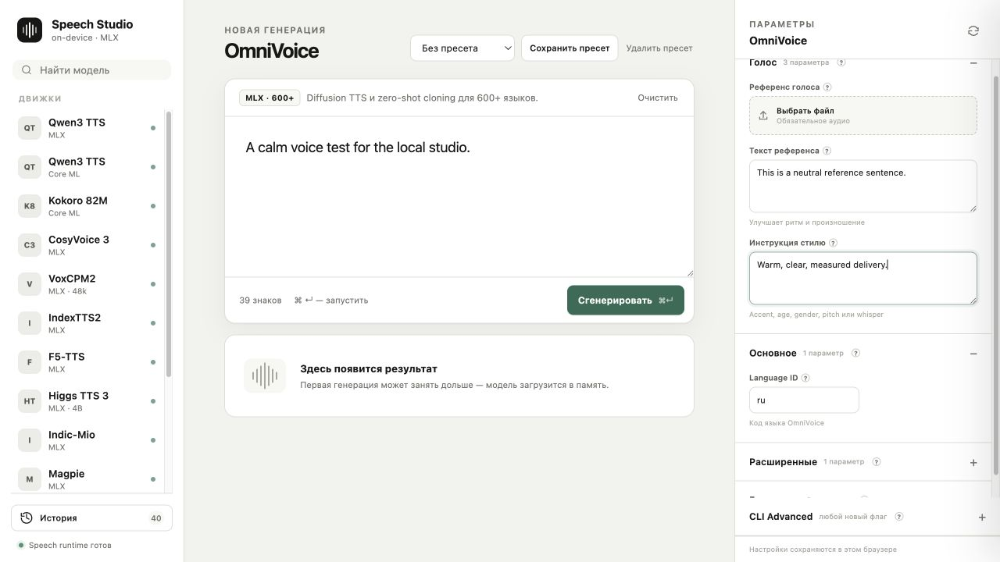
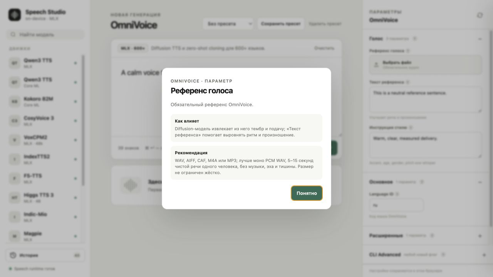

# Speech Swift UI

<p align="center">
  <strong>A calm, local-first studio for on-device speech synthesis on Apple Silicon.</strong><br>
  Tune voices, clone references, inspect model downloads, and master the final WAV — all from one browser window.
</p>

<p align="center">
  
  
  
  
</p>



## What it is

Speech Swift UI is a lightweight companion interface for the [speech-swift](https://github.com/soniqo/speech-swift) command-line runtimes. It is intentionally small: a dependency-free Node server, a static browser UI, and a reusable Swift audio-mastering module.

The UI keeps the complete synthesis loop in one place:

- choose from model-specific TTS engines;
- edit text and model controls without memorizing CLI flags;
- upload reference audio and transcripts for voice cloning;
- see model download/loading progress in the generation log;
- replay, download, and revisit local generation history;
- create a polished “studio version” with a CPU-friendly DSP chain.



## Local by design

- Binds to `127.0.0.1` only.
- Sends text, references, and generated audio to local processes.
- Has no npm runtime dependencies and no hosted backend.
- Stores history, uploads, and generated WAV files in the ignored `StudioWeb/.studio-data/` directory.
- Does not include model weights or MLX/CoreML sources in this repository.

## Quick start

1. Build the companion `speech` and (for OmniVoice) `speech-omni` release binaries from [speech-swift](https://github.com/soniqo/speech-swift).
2. Clone this repository and start the UI:

   ```bash
   cd StudioWeb
   npm start
   ```

3. Open `http://127.0.0.1:4173/`.

If the binaries are elsewhere, configure them explicitly:

```bash
SPEECH_SWIFT_BIN=/path/to/speech \
SPEECH_OMNI_BIN=/path/to/speech-omni \
npm start
```

Node.js 20 or newer is required. Models are downloaded by the selected speech-swift runtime on first use and remain managed by that runtime's normal cache.

## Studio enhancement module

`Sources/AudioCLILib/StudioEnhancer.swift` is a standalone, deterministic DSP chain designed for speech WAV output. It combines:

1. low-cut filtering;
2. gentle corrective EQ;
3. adaptive de-essing;
4. transparent compression;
5. light saturation;
6. short room ambience;
7. loudness normalization and peak limiting.

The companion CLI command is in `StudioEnhanceCommand.swift`:

```bash
speech studio-enhance input.wav --output input_studio.wav
```

The Swift files are intended to be copied into a checkout of `speech-swift`, where their existing `AudioCLILib` and `AudioCommon` targets provide the surrounding command infrastructure.

## Tests

UI tests run without models or network access:

```bash
cd StudioWeb
npm test
```

The Swift DSP tests are in `Tests/StudioEnhancerTests.swift` and cover silence handling, length preservation, and clipping protection when integrated into the parent Swift package.

## Scope and limitations

This repository contains the interface and enhancement module only. It does not redistribute speech models, model weights, or the upstream MLX runtime. Engine availability depends on which release binaries and model caches are installed on the host Mac.

## License

Apache-2.0. See [LICENSE](LICENSE).
